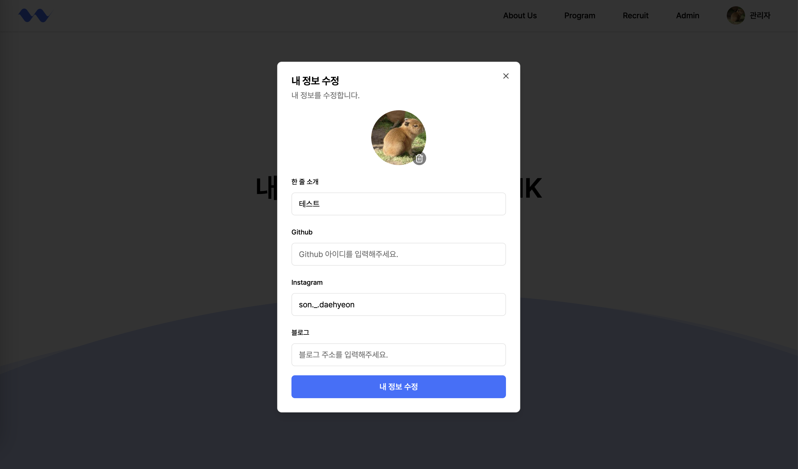
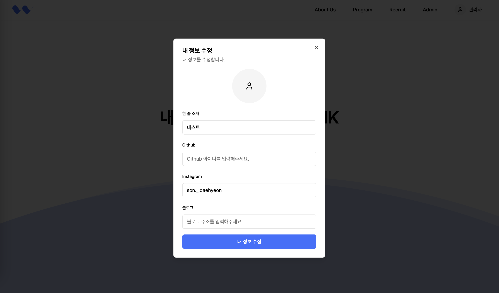

# 2024년 11월 18일 (월)
> S3 캐시로 인한 트러블슈팅

## 개요

윙크 공식 홈페이지를 개발하면서 프로필 사진 추가 및 수정을 테스팅하던 중, 사진이 제대로 변경되지 않는 오류를 마주했다.

1. 기존 프로필 사진이 존재함
    
2. (선택) 프로필 사진을 삭제함
    
3. 다른 프로필 사진을 업로드함
    

**귀여운** 카피바라 사진에서 고라파덕 사진으로 변경하였는데, 제대로 표시되지 않았다.


## 원인

`"프로필 사진이 이미 있는 상태에서 새로운 프로필 사진을 올렸을 때 잘 덮어씌어지지 않는가?"` 라는 생각을 하였지만, 프로필 사진을 완전 삭제 후 다시 올려도 동일한 현상이 발생하였다.

또한, 직접적으로 s3의 url에 접속 시 새로운 사진이 표시되고 있었다.

그리고 새로운 브라우저에서 접속했을 땐 올바르게 사진이 표시되었다.

이 때 부터, 브라우저의 캐시와 관련된 문제라고 생각을 했고, 캐시를 지우고 확인해본 결과 올바르게 사진이 표시가 되었다.


## 해결

가끔 cdn 서비스를 보면 url뒤에 `?v=2` 처럼 의미없는 파라미터를 주는 경우를 보았다.

그래서 이전에 이와 관련하여 알아본적이 있는데, 브라우저에서 해당 리소스를 캐싱을 해두기 때문에, 만약 url이 같은 경우 새로운 파일이더라도 이미 캐싱된 이전 파일을 가져올 수 있다고 들었다.

따라서 서버에서 사진을 업로드 후, `?version=(현재 시간)` 을 넣어 새로운 사진이 올라올 때 마다, url을 다르게 했다.

왜인지 모르겠지만, 이렇게 해도 브라우저에서는 캐시가 hit되어 자꾸 이전 사진만 가져오고 있었다.

stackoverflow를 둘러보다, HTTP Response Header에 ETag가 있는데, 이게 동일할 경우 브라우저는 캐시해둔 리소스를 사용한다고 한다.

> [ETag](https://developer.mozilla.org/ko/docs/Web/HTTP/Headers/ETag) HTTP 응답 헤더는 특정 버전의 리소스를 식별하는 식별자입니다. 웹 서버가 내용을 확인하고 변하지 않았으면, 웹 서버로 full 요청을 보내지 않기 때문에, 캐쉬가 더 효율적이게 되고, 대역폭도 아낄 수 있습니다. 허나, 만약 내용이 변경되었다면, "mid-air collisions" 이라는 리소스 간의 동시 다발적 수정 및 덮어쓰기 현상을 막는데 유용하게 사용됩니다. <br/> <br/> 만약 특정 URL 의 리소스가 변경된다면, 새로운 ETag 가 생성됩니다. ETag 는 지문과 같은 역할을 하면서 다른 서버들이 추적하는 용도에 이용되기도 합니다. ETag 를 비교하여 리소스가 서로 같은지의 여부를 빠르게 판단할 수 있지만, 서버에서 무기한으로 지속될 수 있도록 설정할 수도 있습니다.

따라서 aws에서 사진을 업로드할 때, 이 ETag를 무효화해야 했다.

현재 사진 업로드 로직은 아래와 같다.

1. 프론트엔드에서 백엔드로 사진 업로드 요청
2. 백엔드에서 S3의 Presigned URL 발행 및 리턴
3. 프론트에서 해당 URL로 PUT 요청
4. `/avatar/original/\*.\*` 로 업로드
5. AWS Lambda에서 해당 파일을 400*400 크기로 변환 및 webp로 변환 후 `/avatar/\*.webp` 로 저장
6. 저장 후 백엔드로 콜백
7. 백엔드에서 콜백을 받은 후, DB에 avatar url 설정


### 멍청한 짓

나는 당연히 내 눈에 보이는 실질적인 파일 업로드 로직이 3번이니, 프론트엔드 코드에서 PUT 할 때, S3에게 캐시를 하지 말고, 현재 캐시를 파기해달라고 요청했다.

하지만, 이는 **매우 멍청한 짓**이었다.

최종 프로필 사진은 결국 AWS Lambda가 사진을 처리한 후 올린 webp 파일이 되기 때문이다.


### 진짜 해결

기존 코드는 아래와 같다.
```python
s3_client.put_object(
    Bucket=bucket,
    Key=new_key,
    Body=webp_buffer,
    ContentType='image/webp',
    ACL='public-read'
)
```
하지만, 캐시를 무효화하고, 기존 캐시를 파기하기 위해 여기 2개의 파라미터
```python
Expires='0',
CacheControl='no-cache, no-store, must-revalidate'
```
를 추가하였다.

`Expires`는 캐시 만료 날짜를 설정하는 것 인데, 사실 여기엔 Date가 들어가야 한다.

하지만 우리가 Javascript로 쿠키를 지울 때 하는 것 처럼 그냥 0을 넣어 우회적으로 즉시 삭제할 수 있다.

또한, Cache Control을 통해 캐시를 하지 않도록 설정하였다.