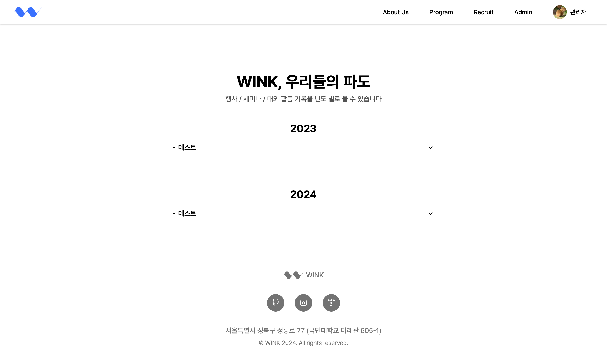

# 2024년 11월 19일 (화)
> Javascript의 Object와 Map

## 개요
윙크 공식 홈페이지 중, 연혁을 볼 수 있는 페이지가 있다.



하지만, 보이다시피 최신 정보를 위로, 즉 내림차순으로 정렬해야 하는데, 지금은 오름차순으로 정렬이 되어있다.

사실 서버에서 관련 데이터 설계를 잘못하여 현재 아래와 같은 스키마를 가진다.

```json
[
    {
        id: "673b1f5979d20faf63063578",
        title: "테스트",
        description: "테스트",
        image: "https://~~~",
        date: "2024-03-01"
    }
]
```

그래서 프론트엔드에서 이를 `{ year: { ... } }` 형태로 그룹화를 해야 했다.
그래서 나는 아래처럼 reduce와 object를 활용하였다.

```js
const { histories } = await Api.Domain.Program.History.getHistories();

const _histories = histories
    .map((history) => ({
        ...history,
        date: toDate(history.date),
    }));

const groupedHistories = _histories.reduce((acc, history) => {
    const year = history.date.getFullYear();

    if (!(year in acc)) {
        acc[year] = []
    }

    acc[year].push(history);

    return acc;
}, {});

setHistories(groupedHistories);
```

그 이후, 이를 year로 정렬시키기 위해 _histories를 year을 기준으로 내림차순 정렬했다.

하지만, reduce가 돌고 난 후에도 그룹화된 객체의 key는 여전히 오름차순으로 정렬되어 있었다.

## 원인

ECMAScript 스펙 중, [ECMA-262](https://262.ecma-international.org/#sec-ordinary-object-internal-methods-and-internal-slots)에 따르면 객체의 키는 아래와 같은 규칙을 따라 정렬된다.

- key가 number라면, 항상 오름차순 정렬된다.
- key가 string 혹은 Symbol이라면, 삽입 순서에 따라 정렬된다.
- ...

따라서, 나는 첫 번째의 경우에 따라 연도가 오름차순으로 정렬되었던 것이다.

## 해결

기존 Javascript에서 key-value를 저장하기 위해 Object를 사용했는데, 이를 해결하기 위해서 ECMA-262에 정의된 순수 데이터 구조인 Map을 사용해야 한다.

|특성|Map|Object|
|------|---|---|
|키 타입|모든 타입|문자열 혹은 Symbol|
|키 순서|삽입 순서 유지|*(위 순서 참조)*|
|프로토타입|없음 (순수 데이터 구조)|`Object.prototype` 상속|

따라서 위의 그룹화 코드를 아래와 같이 수정했다.

```diff
const { histories } = await Api.Domain.Program.History.getHistories();

const _histories = histories
    .map((history) => ({
        ...history,
        date: toDate(history.date),
    }))
+   .sort((a, b) => b.date.getFullYear() - a.date.getFullYear());

const groupedHistories = _histories.reduce((acc, history) => {
    const year = history.date.getFullYear();

-   if (!(year in acc)) {
-       acc[year] = []
-   }
+   if (!acc.has(year)) {
+       acc.set(year, []);
+   }

    acc.get(year)!.push(history);

    return acc;
-}, {});
+}, new Map());

setHistories(groupedHistories);
```

사실 사용법은 거의 비슷하다.

## 마무리

사실 귀찮아서 프론트엔드에서 이를 그룹화하였지만, 내일 백엔드에서 아예 데이터를 가공해서 넘기는 식으로 수정해야겠다.