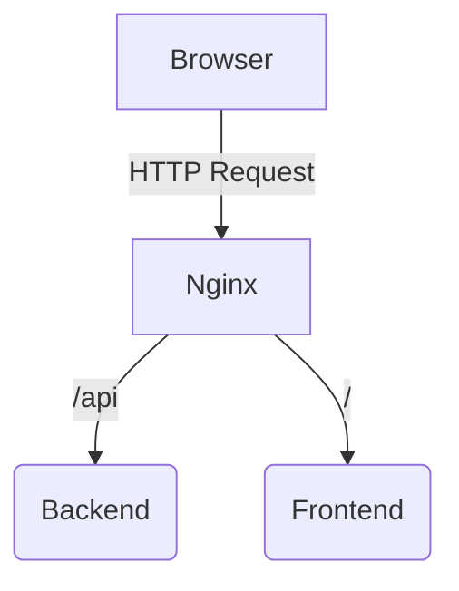
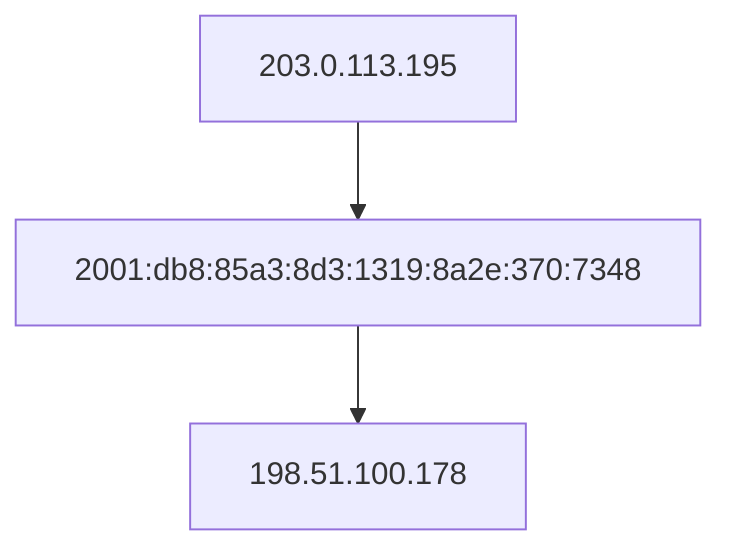

# 2024년 11월 19일 (화)
> 리버스 프록시 상태에서 애플리케이션의 IP 로깅

## 개요
서비스를 배포하기 위해 아래와 같은 아키텍쳐로 설계했다.



Spring Boot에서는 모든 요청을 로깅중이었는데, 콘솔을 보니 아래와 같이 로그가 찍혀 있었다.

```
~생략~ GET /api/user 0:0:0:0:0:0:0:1 200 15ms
```

여기서 `0:0:0:0:0:0:0:1`은 루프백 주소인 `127.0.0.1`과 동일하다.


## 원인
현재 아키텍쳐는 모든 클라이언트 요청을 Nginx가 대신 받은 후, Nginx가 특정 조건에 따라 Frontend 혹은 Backend의 데이터를 위임하여 처리하여 준다.

즉, 일반적인 라우팅이 아닌, Nginx가 대신 요청을 날려 응답을 가져온 후, 이 응답을 클라이언트에게 반환하는 것이다.

따라서, 애플리케이션측에서는 Nginx의 아이피, 즉 자기 자신의 아이피만 찍히게 되는것이다.


## 해결
이를 해결하기 위해선, HTTP 헤더 중, [X-Forwarded-For](https://developer.mozilla.org/en-US/docs/Web/HTTP/Headers/X-Forwarded-For)를 사용해야 한다.

이 헤더는, 프록시를 통과할 때 마다, 그 당시의 IP를 기록해나간다.

만약 아래와 같은 요청이 있었다면, 



헤더는 `X-Forwarded-For: 203.0.113.195,2001:db8:85a3:8d3:1319:8a2e:370:7348,198.51.100.178` 처럼 구성된다.

즉, 애플리케이션에서는 이 헤더를 통해 최초 접속자인 클라이언트의 IP를 얻어낼 수 있다.

최종 Spring Boot 로깅 코드는 아래와 같다.

```java
@Slf4j
@Component
public class LoggingFilter extends OncePerRequestFilter {

    @Override
    public void doFilterInternal(
            @Nonnull HttpServletRequest request,
            @Nonnull HttpServletResponse response,
            @Nonnull FilterChain filterChain
    ) throws ServletException, IOException {

        long start = System.currentTimeMillis();

        filterChain.doFilter(request, response);

        long end = System.currentTimeMillis();
        long elapsed = end - start;

        log.info("{} {} {} {} {}ms",
                request.getMethod(),
                request.getRequestURI(),
                getIp(request),
                response.getStatus(),
                elapsed
        );
    }

    private String getIp(HttpServletRequest request) {

        String xfHeader = request.getHeader("X-Forwarded-For");

        return xfHeader == null ? request.getRemoteAddr() : xfHeader.split(",")[0];
    }
}
```