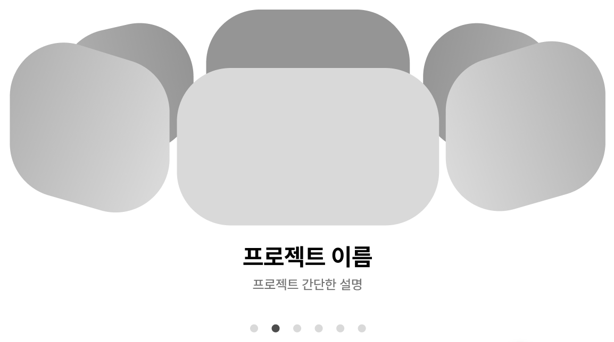
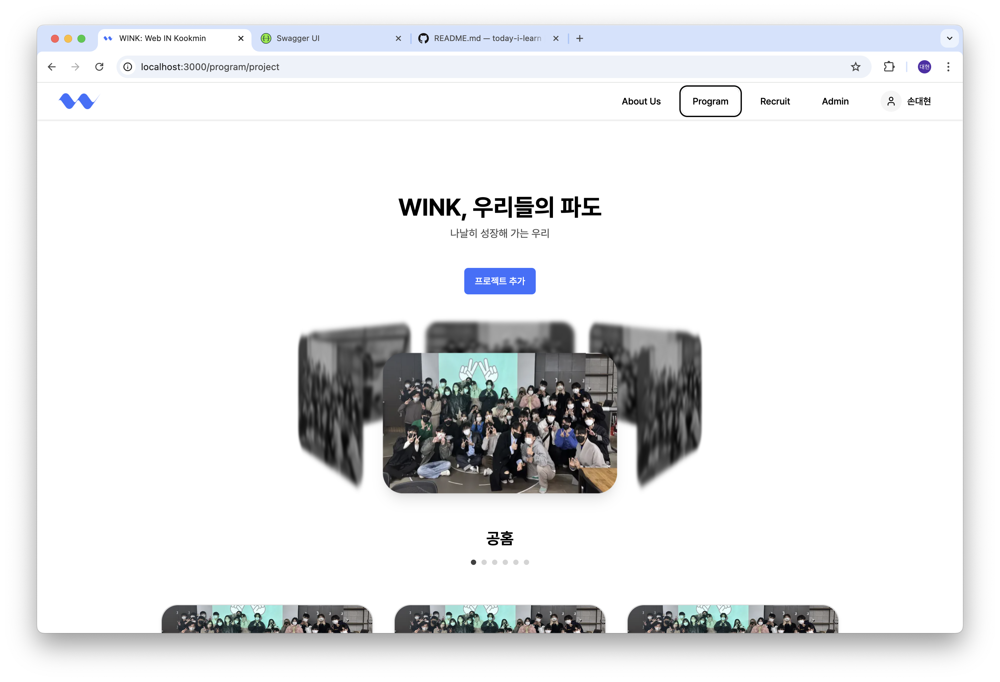

# 2024년 11월 21일 (목)
> CSS의 Perspective

## 개요
~~젠장 왜 윙크 공식 홈페이지는 끝나지 않는 것이야....~~
오늘도 평화롭게 윙크 공식 홈페이지 퍼블리싱을 하던 중, 피그마에서 끔찍한 혼종을 보게 되었다.



젠장... 원 기둥 형태의 Carousel을 만들어야 하는데, 내가 검색을 잘 못하는건지, 이와 관련된 레퍼런스를 많이 찾을 수 없었다.

그나마 있는 레퍼런스는 1학기때 같이 프로젝트를 진행한 진욱이형의 css 코드였다.

```css
.scene {
    width: 295px;
    height: 175px;
    position: relative;
    perspective: 1000px;
    perspective-origin: center -60%;
    margin: 0 auto;
}

.carousel {
    width: 100%;
    height: 100%;
    position: absolute;
    transform-style: preserve-3d;
    transition: all 0.5s ease;
}
```

나머지는 다 괜찮은데, 저기서 perspective는 처음 보는 스타일이었다.

뭔가 저 값을 바꾸면 막 균형을 이루던 Carousel이 요동치길래 이에 대해 알아봤다.

## Perspective

Perspective는 한글로 해석하면 '관점'이라는 뜻인데, 그에 걸맞게 해당 요소를 3D 공간에서 어떻게 보여줄지 결정한다.

아래에 너무 좋은 gif가 있어서 가져왔다. (출처: https://velog.io/@wswy17/CSS-perspective-%EC%9B%90%EA%B7%BC%EB%B2%95)


이 값은 `z=0` 평면 사이의 거리를 정의하게 되는데, 이 때 값이 작을수록 요소가 더 극적으로 왜곡되고, 클수록 더 자연스러운 3D 효과를 만든다.

## 기타

사실 저 Carousel을 만들기 위해 엄청난 수학적 지식을 사용했는데..... 바로 Z축의 위치를 정하기 위해 탄젠트값을 사용했다는 것이다.

```js
const rotateAngle = useMemo(() => 360 / projects.length, [projects.length]);

const radian = useMemo(() => ((rotateAngle / 2) * Math.PI) / 180, [rotateAngle]);

const tangent = useMemo(() => Math.round((275 + 35) / 2 / Math.tan(radian)), [radian]);
```

그래서 저 값을 Z축으로 사용하여 아래의 Image 태그를 회전시켰다.

```html
<Image
    className={cn(
        'absolute w-[275px] h-[165px] cursor-pointer rounded-3xl',
        now ? 'shadow-lg' : 'grayscale brightness-75 blur-sm',
    )}
    style={{
        transform: `rotateY(${thisAngle}deg) translateZ(${tangent}px)`,
    }}
/>
```

## 결과물

짠!

