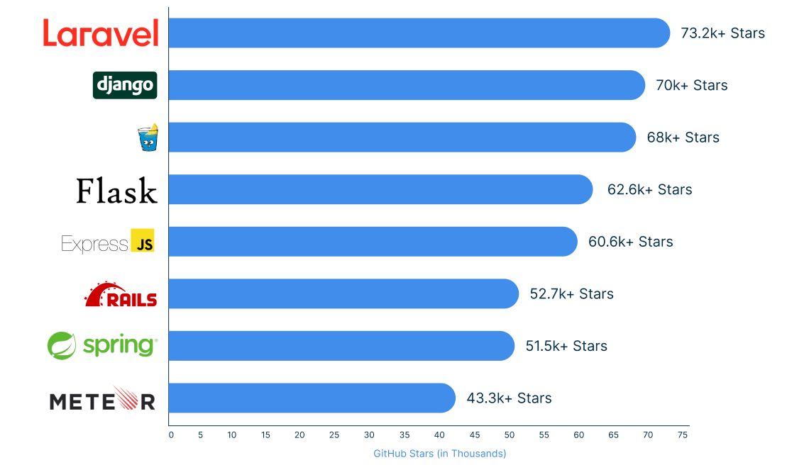

# 2024년 11월 26일 (화)
> 라라벨 찍먹 1일차

## 개요
나는 주기적으로 새로운 기술을 배우고자, 요즘 인기있는 프레임워크들을 자주 알아보는편인데, 이번에 신기한 장면을 목격했다.

구글에 `2024 Backend Framework` 라고 검색하였는데, 아래와 같은 사진이 나왔다.



장고, Flask, Express, Ruby on Rails, Spring은 이미 매우 유명하지만, Laravel은 아예 처음 들어보았고, 3위인 Gin Gonic도 이름만 들어보았다.

물론, 이 순위가 현업에서 많이 쓰이는 순위는 아니지만, 많은 개발자들이 관심을 가지고 있는 만큼 앞으로의 백엔드 생태계에 어느정도 영향을 미칠 수 있을 것 같아 이번에 살짝 찍먹해보기로 결정했다.

## Laravel?
내가 생각하는 PHP는 APM 시절에만 사용되던 구버전 서버 언어인줄 알았는데, 이게 최근까지도 유지보수가되고 성능도 매우 뛰어나다고 한다.

여기서 Laravel은 Spring Boot가 Java 기반인 것 처럼, PHP 기반 웹 풀스택 프레임워크이다.

나의 PHP 경험은 오래 전... XpressEngine을 사용했을 때 였는데, 아래 코드처럼 HTML 코드에 inject 되어있는 형태였다.

```php
<!-- 어쩌고 시작 --->

<p>
    <?php
        echo "안녕하세요 ".$_SESSION['username']."님";
    ?>
</p>

<!-- 어쩌고 끝 --->
```

요즘이어야 JSX<i>(혹은 TSX)</i>가 많이 사용되어 이런 문법이 매우 익숙하지만, 오래 전에는 jQuery를 사용하여 DOM을 직접 관리하여야 했기에 이당시에 매우 혁신적인 프레임워크였다.

## Laravel 개발 환경 설정
