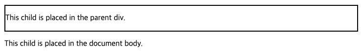

# 2024년 11월 28일 (목)
> React Portal

## 개요
이번 공홈 프로젝트를 진행하면서 shadcn을 사용하였는데, 코드 분석을 하다가 아래 코드를 보게 되었다.

```jsx
const DialogContent = React.forwardRef<
  React.ElementRef<typeof DialogPrimitive.Content>,
  React.ComponentPropsWithoutRef<typeof DialogPrimitive.Content>
>(({ className, children, ...props }, ref) => (
  <DialogPortal>
    <DialogOverlay />
    <DialogPrimitive.Content
      ref={ref}
      className={cn(
        "fixed left-[50%] top-[50%] z-50 grid w-full max-w-lg translate-x-[-50%] translate-y-[-50%] gap-4 border bg-background p-6 shadow-lg duration-200 data-[state=open]:animate-in data-[state=closed]:animate-out data-[state=closed]:fade-out-0 data-[state=open]:fade-in-0 data-[state=closed]:zoom-out-95 data-[state=open]:zoom-in-95 data-[state=closed]:slide-out-to-left-1/2 data-[state=closed]:slide-out-to-top-[48%] data-[state=open]:slide-in-from-left-1/2 data-[state=open]:slide-in-from-top-[48%] sm:rounded-lg",
        className
      )}
      {...props}
    >
      {children}
      <DialogPrimitive.Close className="absolute right-4 top-4 rounded-sm opacity-70 ring-offset-background transition-opacity hover:opacity-100 focus:outline-none focus:ring-2 focus:ring-ring focus:ring-offset-2 disabled:pointer-events-none data-[state=open]:bg-accent data-[state=open]:text-muted-foreground">
        <X className="h-4 w-4" />
        <span className="sr-only">Close</span>
      </DialogPrimitive.Close>
    </DialogPrimitive.Content>
  </DialogPortal>
))
```

여기서 눈에 띄는 부분이 있었는데, 바로 `DialogPortal` 이었다.

아마 예전 velog 순위 게시글을 뒤져보다가 `portal`에 관하여 보았는데, 그로 인해 더욱 눈길이 갔던 것 같다.

사실 컴포넌트에서 `Dialog`를 만들고자 한다면 조금 애매한 감이 있는게, `Dialog`는 최상단에서 렌더링되는게 가장 깔끔한 방법이라 생각하기 때문이다.

하지만 대부분의 경우 페이지 단위에서 `Dialog`를 호출하기 때문에, 위와 같은 패턴으로 구현하기가 까다롭다.

> store을 사용해서 visible state를 페이지에서 관리하고, 최상단 layout에 모달 관련 코드를 넣으면 가능이야 하지만, 모달이 늘어날 때 마다 최상단에서 관리해야 한다는 점이 좀 그릏다...

## React Portal

**사실 위의 내용만 봐도 대충 Portal이 무엇인지 감이 잡힐 수 있다.**

Portal. 공간과 공간을 잇는 출입구 라는 뜻이다.

즉, 하위 DOM에서 다른 DOM에 렌더링을 할 수 있는 기법이다.

따라서 위의 `Dialog` 같은 경우, 페이지 단위에서 컴포넌트를 `body` 바로 아래에 렌더링시킬 수 있다.

```jsx
import { createPortal } from 'react-dom';

export function Dialog({ message }) {
  return (
    <div>
      {isVisible && createPortal(
        <p>{message}</p>,
        document.body
      )}
    </div>
  );
}
```

바로 예시 코드인데, `createPortal`은 총 3개의 인자를 받을 수 있다. 첫 인자는 Element를 넘겨주면 되고, 두번째 인자는 어디에 렌더링시킬지를 넘겨주면 된다. *(마지막 인자는 선택 옵션으로 key를 지정해줄 수 있다.)*

---

```jsx
import { createPortal } from 'react-dom';

export default function MyComponent() {
  return (
    <div style={{ border: '2px solid black' }}>
      <p>This child is placed in the parent div.</p>
      {createPortal(
        <p>This child is placed in the document body.</p>,
        document.body
      )}
    </div>
  );
}
```

이런 코드가 있을 경우, 일반적으로 두 번째 p태그는 상위 div의 style을 따르지만, portal로 외부에서 렌더링되기 때문에 border가 생성되지 않는다.



즉, 위 코드를 react에서 아래와 같이 렌더링시킨다.

```html
<body>
    <div id="root">
        <div style="border: 2px solid black">
            <p>This child is placed inside the parent div.</p>
        </div>
    </div>
    <p>This child is placed in the document body.</p>
</body>
```