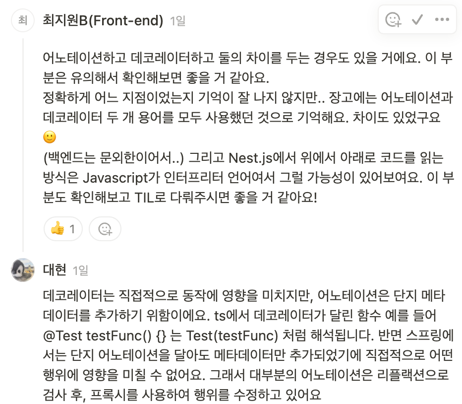

# 2024년 12월 2일 (월)
> Annotation VS Decorator (Decorator 편)

## 개요


그래서 어노테이션과 데코레이터의 차이를 더욱 자세히 알아보고자 한다.

일단 어노테이션은 주로 컴파일 기반 언어에서, 데코레이터는 인터프리터 기반 언어에서 작동한다.

위에 기반하여 어노테이션은 런타임 당시 어떤 작업을 수정할 수 없기에 메타데이터만 수정하는 것이고, 데코레이터는 런타임 당시 어떤 작업을 할 수 있는 것이다.

## 데코레이터

데코레이터는 주로 Typescript, Python 언어에서 쓰인다.

아래 예제는 모두 ts 기반이다.

### 데코레이터 함수

```ts
function testDeco(target: any, propertyKey: string, descriptor: PropertyDescriptor) {
  console.log('testDeco 평가됨');
}

@testDeco
function testFunc() {
    console.log('testFunc 호출됨')
}
```

위 출력은
```
testDeco 평가됨
testFunc 호출됨
```
이다.

### 데코레이터 팩토리

가끔 데코레이터 그 자체에 어떤 인자를 주는 경우도 있다.

Nest에서도 라우팅을 위해 `@Get('/test')` 와 같이 Get이라는 데코레이터에 url라는 파라미터를 넘겨주는데, 이는 아래처럼 팩토리를 사용해야 한다.

```ts
function testDeco(message: string) {
    console.log('testDeco 평가됨');

    return function (target: any, propertyKey: string, descriptor: PropertyDescriptor) {
        console.log(`testDeco(${message}) 호출됨 `)
    };
}

@testDeco('메시지')
function testFunc() {
    console.log('testFunc 호출됨')
}
```

위 출력은
```
testDeco 평가됨
testDeco(메시지) 호출됨
testFunc 호출됨
```
이다.

> **평가됨 vs 호출됨:** <br/>
> 평가<i>(Evaluation)</i>은 코드가 로드될 때 클래스나 함수가 정의될 때 발생된다. (전체 코드에서 한번만 실행) <br/>
>  호출<i>(Invocation)</i>은 실제 데코레이터 함수 적용되는 시점이다.

### 합성 데코레이터
만약, 데코레이터가 2개 이상 오는 경우는 어떻게 될까?

```ts
@testDeco1  // 평가 시 'testDeco1 평가됨', 호출 시 'testDeco1 호출됨' 출력
@testDeco2  // 평가 시 'testDeco2 평가됨', 호출 시 'testDeco2 호출됨' 출력
function testFunc() {
    console.log('testFunc 호출됨')
}
```

이 경우 testDeco1, testDeco2 둘 중 어떤 데코레이터가 먼저 평가 혹은 호출될까?

사실 데코레이터의 원리를 알아보면 쉽게 해결할 수 있다.

위 함수는 아래처럼 다시 쓸 수 있다.

```ts
testFunc = testDeco1(testDeco2(testFunc))
```

그럼, 당연히 평가는 위에서 아래 방향으로 되고, 호출은 아래에서 위 방향으로 될 것이다.

### 함수 데코레이터
사실 우리가 원하는 데코레이터는 이렇게 간단한 게 아니다.

예를 들어 타임 퍼포먼스 측정을 위한 AOP를 만든다고 생각해보자.

```ts
function timeLogging(target: any, propertyKey: string, descriptor: PropertyDescriptor) {
    // ?
};
```

지금까지 우리가 살펴 본 예시들은 모두 데코레이터가 실행 후 본 함수가 실행된다.

하지만 위와 같이 타임 퍼포먼스 측정기를 만들 경우는 데코레이터 중간에서 본 함수가 실행되어야 한다.

위 데코레이터 선언부에서 보면 `PropertyDescritor` 타입의 파라미터를 받는데, 아래와 같은 형태이다

```ts
interface PropertyDescriptor {
 configurable?: boolean;    // 속성의 정의를 수정할 수 있는지 여부
 enumerable?: boolean;      // 열거형인지 여부
 value?: any;               // 속성 값
 writable?: boolean;        // 수정 가능 여부
 get?(): any;               // getter
 set?(v: any): void;        // setter
}
```

여기서 가장 중요한 `value`는 본 함수를 가지고 있다. 따라서 아래처럼 의도하는 데코레이터를 만들 수 있다.

```ts
function timeLogging(target: any, propertyKey: string, descriptor: PropertyDescriptor) {
    const origin = descriptor.value;

    descriptor.value = function (...args: unknown) {
        const before = new Date().getTime();
        origin();
        const after = new Date().getTime();

        console.log(`elapsed time : ${after - before}ms`);
    }
};
```

하지만 위 코드의 문제는 `value`를 오버라이하며 `value` 안의 `this`가 모호해진다.

따라서 아래처럼 `apply`를 통해 `this`를 바인딩해줘야 한다.

```ts
function timeLogging(target: any, propertyKey: string, descriptor: PropertyDescriptor) {
    const origin = descriptor.value;

    descriptor.value = function (...args: unknown) {
        const before = new Date().getTime();
        origin.apply(this, args);
        const after = new Date().getTime();

        console.log(`elapsed time : ${after - before}ms`);
    }
};
```

위에서는 함수 데코레이터만 설명했지만, 사실 데코레이터는 클래스, 접근자, 프로퍼티, 파라미터 등 다양한 곳에 사용될 수 있다.