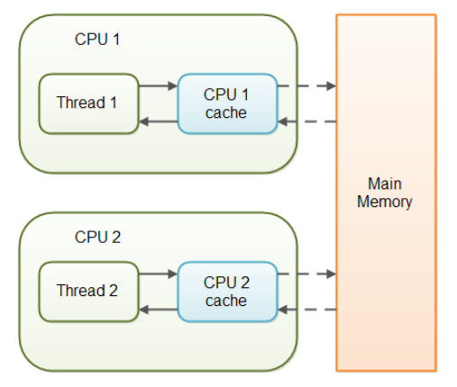

# 2024년 12월 6일 (금)
> Java Volatile

## 개요
이전 TIL인 원자성 변수에 대해 알아보다가 내가 사용하고 있는 zulu에서는 어떻게 이를 구현했을지 궁금하여 코드를 열어봤다.

아래는 AtomicReference의 일부 코드이다.

```java
public class AtomicReference<V> {

    private volatile V value;

    public AtomicReference(V initialValue) {
        value = initialValue;
    }

    public final V get() {
        return value;
    }
    
    public final void set(V newValue) {
        value = newValue;
    }
}
```

일반적으로 데이터를 저장하는 클래스와 같이 데이터 필드, 생성자, 게터와 세터가 존재하는 모습인데, 조금 이질감이 드는 키워드가 있었다.

바로 volatile이다.

나는 자바에 이런 키워드가 있었나? 정도로 내 기준 매우 희귀한 키워드였다.

## 뜻
먼저, volatile의 뜻을 살펴보았는데, "휘발성 물질" 이라는 뜻을 가지고 있다.

그래서 조금 의아했는데, 일반적으로 JVM내의 변수도 대부분 힙 영역에 저장되기 때문에 휘발성이기 때문이다.

알고보니 뜻이 상관없다고 한다...

## 그럼 뭘까?
바로 멀티 스레드 환경에서 메모리 가시을 보장하기 위해 사용된다.

일반적으로 JVM에서 변수는 메인 메모리의 일부분에 JVM 힙 영역에 저장된다.

따라서 변수를 선언하면 일단 메인 메모리에 올라가게 되는데, 이를 읽을때는 JVM 힙 영역에 캐싱된 값을 사용한다.



위 사진에는 두 개의 스레드가 존재하는데, 이 때 하나의 값을 읽고 쓴다고 가정하자.

그럼 CPU1 캐시와 CPU2의 캐시가 항상 동일할까? 그 답은 "아니다"이다.

이렇기에 volatile 키워드를 변수에 붙이게 되면, 스레드에서 바로 메인 메모리에 접근하여 값을 읽고 쓸 수 있다.

## 예시
```java
public class Example {
    @Getter @Setter
    private boolean running = true;

    public void run() {
        while (running) {
            System.out.println("실행중");
        }
        System.out.println("정지됨");
    }
}
```

```java
public static void main(String[] args) {
    Example example = new Example();
	
    example.run();
    
    Thread.sleep(1000);
    
    example.setRunnig(false);
}
```

멀티 스레드 프로그래밍을 조금이라도 해보았다면, 위 main 메소드에서 running을 false로 수정했다 하더라도, Example의 run이 멈추지 않는다는 사실은 당연하다.

그럼 외부에서 run()을 정지시킬 방법이 있을까?

따로 Executor와 같이 스레드를 다룰 수 있는 API가 있지 않는한, 이를 구현할 방법은 없다.

반면 위 running flag를 volatile로 선언해보자.

```java
public class Example {
    @Getter @Setter
    private volatile boolean running = true;

    public void run() {
        while (running) {
            System.out.println("실행중");
        }
        System.out.println("정지됨");
    }
}
```

이러면 main함수에서 메인 메모리의 running을 직접 수정하고, run에서도 메인 메모리의 running을 바로 읽기 때문에, 수정되자마자 run()이 정지 상태로 바뀔것이다.

## 한계점

volatile이 메인 메모리에 저장된다고 해서 원자성이 보장되지는 않는다.

따라서 원자성을 보장하기 위해서는 synchronized 블록이나 원자성 변수인 Atomic을 사용해야 한다.